<div align="center">

<!-- ══════════════════════════════════════════════════════════════════ -->
<!--                    CINEMATIC HERO SEQUENCE GATEWAY                -->
<!-- ══════════════════════════════════════════════════════════════════ -->

<a href="https://rudra795.github.io/RUDRA795/web/">
  
</a>

<br><br>

<a href="https://rudra795.github.io/RUDRA795/web/">
  
</a>
<a href="https://github.com/RUDRA795">
  
</a>
<a href="#-flagship-architecture--dhammu">
  
</a>

<br><br>


<br>


</div>

---

# 🧬 Identity & Manifest

```text
> identity.load("Rohit Lakas")
> status.set("AI Engineer in the Making")
> core.affinity(["Artificial Intelligence", "Machine Learning", "Data Science", "Agentic Systems"])
> execution_mode.set("BUILD / EXPERIMENT / SHIP")
```

> *"Building intelligent systems, experimenting with AI, and turning ideas into real-world products."*

I am **Rohit Lakas**, a Computer Science and Engineering (Data Science) student focused on the engineering principles behind machine intelligence. Rather than treating AI as a black box or collecting surface-level badges, I build systems from the ground up — from **agentic desktop assistants and dynamic programming optimization engines to urban geospatial intelligence platforms and conversational oceanographic analytics**.

---

# ⚡ Subsystem Telemetry HUD

<div align="center">
  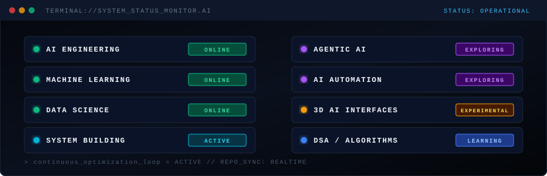
</div>

<br>

<div align="center">

| Subsystem | Focus Layer | Status |
| :--- | :--- | :---: |
| **AI Engineering** | Neural architectures, model integration & evaluation | `🟢 ONLINE` |
| **Machine Learning** | Predictive modeling, scikit-learn & algorithmic workflows | `🟢 ONLINE` |
| **Data Science** | High-dimensional data manipulation (NumPy/Pandas) | `🟢 ONLINE` |
| **Agentic AI** | Autonomous multi-step planning, tool use & execution | `🟣 EXPLORING` |
| **Intelligent Automation** | Safe OS interaction & API orchestration | `🟣 EXPLORING` |
| **3D / Immersive Interfaces** | Canvas 2D / WebGL interactive computing | `🟡 EXPERIMENTAL` |
| **DSA & System Design** | Optimization, graphs, recursion & dynamic programming | `🔵 LEARNING` |
| **System Building** | Full-stack engineering, Android, Firebase & Cloud | `🟢 ACTIVE` |

</div>

---

# 🤖 Flagship Architecture — Dhammu

<div align="center">
  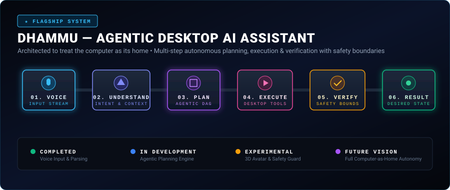
</div>

### `A Desktop AI Assistant Designed to Treat the Computer as Its Home`

**Dhammu** is an exploration into agentic artificial intelligence operating beyond the browser window. Traditional AI assistants are trapped inside conversational tabs; Dhammu is architected as an autonomous entity that treats the personal workstation as an integrated environment.

### 🔄 Multi-Stage Execution Pipeline

```text
  ┌───────────┐      ┌──────────────┐      ┌────────────┐
  │ 01. VOICE ├─────►│02. UNDERSTAND├─────►│  03. PLAN  │
  └───────────┘      └──────────────┘      └─────┬──────┘
                                                 │
  ┌───────────┐      ┌──────────────┐      ┌─────▼──────┐
  │ 06. RESULT│◄─────┤  05. VERIFY  │◄─────┤04. EXECUTE │
  └───────────┘      └──────────────┘      └────────────┘
```

1. **VOICE**: Continuous streaming audio buffer with 16kHz PCM transcription and intent parsing.
2. **UNDERSTAND**: Multi-turn semantic comprehension extracting active application state and workspace context.
3. **PLAN**: Autonomous decomposition of instructions into Directed Acyclic Graphs (DAGs) and dynamic tool chains.
4. **EXECUTE**: Sandbox tool execution (file management, desktop applications, API triggers).
5. **VERIFY**: Boundary validation asserting safety constraints before irreversible actions occur.
6. **RESULT**: Desired state validation and conversational response synthesis.

### ⚖️ Technical Maturity Matrix

* `🟢 COMPLETED`: Voice stream capture, speech-to-intent pipeline, contextual prompt construction.
* `🔵 IN DEVELOPMENT`: Directed Acyclic Graph (DAG) planner, desktop file manipulation tools.
* `🟡 EXPERIMENTAL`: 3D interactive avatar presence and boundary-gate safety validation.
* `🟣 FUTURE VISION`: Full multi-application autonomous desktop ecology.

---

# 🌌 Specialized Systems Universe

<div align="center">

### 🏥 OptiCure AI — Multistage Graph & Dynamic Programming
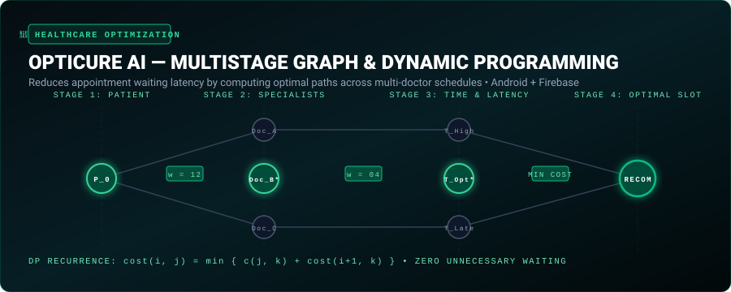

</div>

* **Core Innovation**: Models clinic doctor scheduling as a **Multistage Graph**, utilizing **Dynamic Programming** backward recurrence to minimize total patient waiting time.
* **Recurrence**: `cost(i, j) = min { c(j, k) + cost(i + 1, k) }`
* **Stack**: Dynamic Programming • Android • Firebase • Graph Algorithms

---

<div align="center">

### 🏙️ NagariX — AI Urban Intelligence & Municipal Command Platform


</div>

* **Core Innovation**: Translates raw citizen reports into actionable city intelligence via automated **AI computer vision triage** for infrastructure damage coupled with **geospatial DBSCAN clustering** to identify recurring ward issues and avert municipal SLA failures.
* **Stack**: Civic Intelligence • Geospatial Clustering • Vision Triage • SLA Risk Radar • Python

---

<div align="center">

### 🌊 Nereus AI — Conversational Oceanographic Science
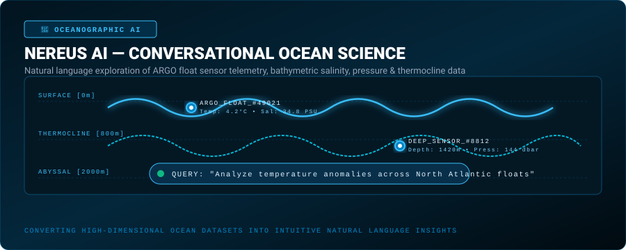

</div>

* **Core Innovation**: Natural language conversational interface to navigate high-dimensional global **ARGO float telemetry**, bathymetric salinity profiles, pressure, and thermocline shifts.
* **Stack**: Conversational AI • ARGO Sensor Data • Scientific Visualization • Data Analytics

---

<div align="center">

### 🔮 DSphere / DSAURA — AI Event Intelligence & Spatial Aura Assistant

</div>

* **Core Innovation**: Experimental spatial assistant concept featuring a 3D responsive aura orb that shifts frequency, particle density, and color in response to dynamic conference agendas and attendee networking.
* **Stack**: 3D Spatial Interfaces • Event Intelligence • Real-time Kinetic Interaction

---

# ⚔️ Original AI Warrior Character Rotation

<p align="center">
  <em>Each character represents an archetype of computational power and engineering focus. Randomly materialized in the <a href="https://rudra795.github.io/RUDRA795/web/">interactive web experience</a>.</em>
</p>

<div align="center">

| Blue Striker | Solar Ascendant | Void Monarch | Cyber Aegis | Celestial Herald |
| :---: | :---: | :---: | :---: | :---: |
|  |  |  |  |  |
| **Cyan Warrior** | **Golden Warrior** | **Void Warrior** | **Cyber Warrior** | **Celestial Warrior** |
| Dual Photon Sabers | Solar Energy Glaive | Gravitational Scythe | Holographic Aegis | Astral Starlight Wings |
| *Agentic AI* | *Machine Learning* | *Algorithms & DSA* | *System Architecture* | *Unified Intelligence* |

</div>

---

# 🛠️ Technical Arsenal

<div align="center">

### Core Programming Languages
<p>
  
  
  
  
  
  
</p>

### Artificial Intelligence & Data Science
<p>
  
  
  
  
  
</p>

### Web, Mobile & Applications
<p>
  
  
  
  
  
</p>

### Cloud, Backend & Databases
<p>
  
  
  
  
  
  
</p>

</div>

---

# 🌀 The Engineering Recursion Loop

<div align="center">
  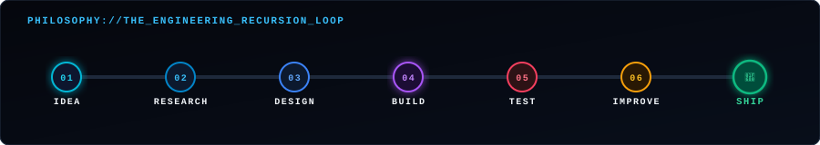
</div>

```text
IDEA ──► RESEARCH ──► DESIGN ──► BUILD ──► TEST ──► IMPROVE ──► SHIP ──┐
  ▲                                                                    │
  └──────────────────────────── ITERATE ───────────────────────────────┘
```

---

# 📊 GitHub Analytics

<div align="center">


&nbsp;


<br><br>


&nbsp;


<br><br>


</div>

---

# ⚡ Direct Signal & Contact

<div align="center">

```text
┌─────────────────────────────────────────────────────────────────┐
│                                                                 │
│              BUILD SOMETHING THAT FEELS ALIVE.                  │
│                                                                 │
└─────────────────────────────────────────────────────────────────┘
```

<br>

<a href="mailto:lakasrohit34@gmail.com">
  
</a>
&nbsp;
<a href="https://github.com/RUDRA795">
  
</a>
&nbsp;
<a href="https://rudra795.github.io/RUDRA795/web/">
  
</a>

<br><br>


</div>
